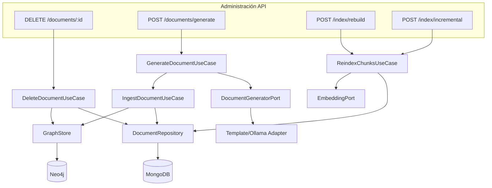

# Plan de ejecución Fase 4 - Administración de corpus e índice

## Objetivo operativo

Completar el contrato API de administración documental e indexación para que la gestión del corpus sea íntegra por API, sin intervención manual en MongoDB ni Neo4j.

## Base actual relevante

- **Documentos**: `DocumentsController` expone `POST /documents/text`, `POST /documents/upload`, `GET /documents`. No existe `DELETE` ni `POST /documents/generate`.
- **Repositorio**: `DocumentRepositoryPort` y `MongoDocumentRepository` tienen `listDocuments`, `findDocumentById`, `addChunks`, `listAllChunks`, `updateChunkEmbedding`. No existe `deleteDocument` ni `deleteChunksByDocumentId`.
- **Grafo**: `GraphStorePort` tiene `upsertGraph`, `findEntitiesByNames`, `findRelationshipsForEntityIds`. No existe `deleteByDocumentId`.
- **Índice**: `ReindexChunksUseCase` existe y se ejecuta vía `npm run reindex`. No hay endpoints HTTP para rebuild/incremental.
- **Modelo**: `DocumentSource` ya incluye `{ kind: 'generated', useCaseId: string }`.

## Alcance de implementación

### 1. DELETE /documents/:id con limpieza en Mongo y Neo4j

**Objetivo**: Eliminar un documento y toda su huella en Mongo y Neo4j.

**Tareas**:
- Añadir `deleteDocument(documentId: string)` a `DocumentRepositoryPort`.
- Implementar en `MongoDocumentRepository`:
  - Eliminar documento de `documents`.
  - Eliminar chunks del documento de `chunks`.
  - Eliminar eventos de outbox asociados al documento de `graph_sync_outbox`.
- Añadir `deleteByDocumentId(documentId: string)` a `GraphStorePort`.
- Implementar en `Neo4jGraphStoreAdapter`:
  - Eliminar nodo `Document` con `documentId`.
  - Eliminar relaciones `MENTIONS` del documento.
  - Eliminar entidades cuyo `entityId` contenga el `documentId` y sus relaciones `RELATED` (o limpiar relaciones que referencian chunks del documento).
- Crear `DeleteDocumentUseCase` que orqueste repositorio y grafo.
- Añadir ruta `DELETE /documents/:id` en `DocumentsController`.

**Archivos objetivo**:
- `src/modules/documents/domain/ports/document-repository.port.ts`
- `src/modules/documents/infrastructure/mongo/mongo-document.repository.ts`
- `src/modules/graph/domain/ports/graph-store.port.ts`
- `src/modules/graph/infrastructure/neo4j/neo4j-graph-store.adapter.ts`
- `src/modules/documents/application/delete-document.usecase.ts` (nuevo)
- `src/modules/documents/presentation/documents.controller.ts`

### 2. POST /documents/generate para documentos por caso de uso

**Objetivo**: Generar e ingestar documentos programáticamente según un caso de uso (template o LLM).

**Tareas**:
- Definir `DocumentGeneratorPort` con `generate(useCaseId: string, params?: Record<string, unknown>): Promise<string>`.
- Crear adaptador inicial (ej. `TemplateDocumentGeneratorAdapter` o `OllamaDocumentGeneratorAdapter`) que produzca texto según `useCaseId` y parámetros.
- Crear `GenerateDocumentUseCase` que invoque el generador e ingeste el resultado vía `IngestDocumentUseCase` con `source: { kind: 'generated', useCaseId }`.
- Añadir DTO `GenerateDocumentDto` con `useCaseId` y `params` opcionales.
- Añadir ruta `POST /documents/generate` en `DocumentsController`.

**Archivos objetivo**:
- `src/modules/documents/domain/ports/document-generator.port.ts` (nuevo)
- `src/modules/documents/infrastructure/generators/template-document-generator.adapter.ts` (nuevo, o ollama)
- `src/modules/documents/application/generate-document.usecase.ts` (nuevo)
- `src/modules/documents/presentation/documents.dto.ts`
- `src/modules/documents/presentation/documents.controller.ts`
- `src/shared/di.tokens.ts`
- `src/app.module.ts`

### 3. POST /index/rebuild y POST /index/incremental

**Objetivo**: Exponer operaciones de reindexación por API.

**Tareas**:
- Crear `IndexController` (o extender uno existente) con rutas administrativas.
- `POST /index/rebuild`: invoca `ReindexChunksUseCase` con todos los chunks (o límite configurable). Opcionalmente dispara re-extracción de grafo si se define.
- `POST /index/incremental`: reindexa solo chunks que no tienen `embeddingModel` o tienen modelo distinto al actual (chunks desactualizados).
- Añadir `listChunksByDocumentId` y/o filtro en `listAllChunks` si se necesita para incremental por documento.
- DTOs para request (ej. `limit`, `documentId` opcional).

**Archivos objetivo**:
- `src/modules/index/presentation/index.controller.ts` (nuevo módulo o en ingestion)
- `src/modules/ingestion/application/reindex-chunks.usecase.ts` (extender para incremental)
- `src/modules/documents/domain/ports/document-repository.port.ts` (listChunksByDocumentId si aplica)
- `src/app.module.ts`

### 4. Opcional: ingesta por URL

**Objetivo**: Ingestar contenido desde una URL con extracción controlada.

**Tareas**:
- Crear `UrlContentExtractorPort` y adaptador (fetch + extracción de texto/html).
- Añadir `POST /documents/ingest-url` con body `{ url: string, title?: string }`.
- Integrar con `IngestDocumentUseCase` usando `source: { kind: 'url', url }`.

**Archivos objetivo**:
- `src/modules/ingestion/domain/ports/url-content-extractor.port.ts`
- `src/modules/ingestion/infrastructure/url/url-content-extractor.adapter.ts`
- `src/modules/documents/presentation/documents.controller.ts`

### 5. Validación y documentación

- Probar flujos completos: delete, generate, rebuild, incremental.
- Actualizar `CHANGELOG.md`.
- Crear o actualizar ADR para decisiones de administración de corpus.

## Flujo objetivo (alto nivel)

## Criterios de aceptación de Fase 4

- `DELETE /documents/:id` elimina documento, chunks y outbox en Mongo, y nodo Document + entidades/relaciones asociadas en Neo4j.
- `POST /documents/generate` produce e ingesta un documento con `source.kind: 'generated'` y `useCaseId` especificado.
- `POST /index/rebuild` reindexa embeddings de chunks (y opcionalmente grafo).
- `POST /index/incremental` reindexa solo chunks desactualizados.
- Administración del corpus es completa por API sin intervención manual de bases de datos.
- Documentación (CHANGELOG + ADR) actualizada.

## Preparación inmediata del desarrollo (orden de trabajo)

1. **Delete document**: puerto + implementación Mongo/Neo4j + use case + controller.
2. **Generate document**: puerto + adaptador generador + use case + controller.
3. **Index rebuild/incremental**: extender ReindexChunksUseCase + controller.
4. **Opcional**: ingesta por URL.
5. Validación funcional y documentación.
