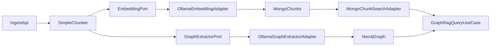

# Plan de ejecución Fase 1 (Ollama, alcance completo)

## Objetivo operativo

Elevar la calidad de recuperación y grounding reemplazando componentes placeholder por adapters productivos sobre Ollama, sin romper la arquitectura hexagonal existente.

## Base actual relevante

- La ingesta usa embeddings determinísticos en `embedding` desde `[memory_architecture/brain_service/src/modules/ingestion/application/deterministic-embedding.service.ts](memory_architecture/brain_service/src/modules/ingestion/application/deterministic-embedding.service.ts)`.
- La extracción de grafo es naive y document-level en `[memory_architecture/brain_service/src/modules/ingestion/application/naive-graph-extractor.service.ts](memory_architecture/brain_service/src/modules/ingestion/application/naive-graph-extractor.service.ts)`.
- La búsqueda híbrida calcula vector query también con embedding determinístico en `[memory_architecture/brain_service/src/modules/search/infrastructure/mongo/mongo-chunk-search.adapter.ts](memory_architecture/brain_service/src/modules/search/infrastructure/mongo/mongo-chunk-search.adapter.ts)`.

## Alcance de implementación

1. **Introducir puertos de dominio para IA en ingesta/search**
  - Crear puerto de embeddings y puerto de extracción estructurada para desacoplar casos de uso de proveedores concretos.
  - Archivos objetivo:
    - `[memory_architecture/brain_service/src/modules/ingestion/domain/ports/embedding.port.ts](memory_architecture/brain_service/src/modules/ingestion/domain/ports/embedding.port.ts)`
    - `[memory_architecture/brain_service/src/modules/ingestion/domain/ports/graph-extractor.port.ts](memory_architecture/brain_service/src/modules/ingestion/domain/ports/graph-extractor.port.ts)`
    - `[memory_architecture/brain_service/src/shared/di.tokens.ts](memory_architecture/brain_service/src/shared/di.tokens.ts)`
2. **Implementar adapters reales de Ollama**
  - Adapter de embeddings contra endpoint `/api/embeddings` de Ollama.
  - Adapter de extracción estructurada (JSON estricto) para entidades/relaciones y `sourceChunkId` por chunk.
  - Archivos objetivo:
    - `[memory_architecture/brain_service/src/modules/ingestion/infrastructure/ollama/ollama-embedding.adapter.ts](memory_architecture/brain_service/src/modules/ingestion/infrastructure/ollama/ollama-embedding.adapter.ts)`
    - `[memory_architecture/brain_service/src/modules/ingestion/infrastructure/ollama/ollama-graph-extractor.adapter.ts](memory_architecture/brain_service/src/modules/ingestion/infrastructure/ollama/ollama-graph-extractor.adapter.ts)`
3. **Refactor de pipeline de ingesta para usar puertos y versionado**
  - Reemplazar dependencias concretas en `IngestDocumentUseCase` por puertos.
  - Persistir `embedding_model` y `extraction_model` en metadata de documento y/o chunk.
  - Extraer grafo por chunk (no documento completo) para trazabilidad real en `sourceChunkId`.
  - Archivos objetivo:
    - `[memory_architecture/brain_service/src/modules/ingestion/application/ingest-document.usecase.ts](memory_architecture/brain_service/src/modules/ingestion/application/ingest-document.usecase.ts)`
    - `[memory_architecture/brain_service/src/modules/documents/domain/models/document.model.ts](memory_architecture/brain_service/src/modules/documents/domain/models/document.model.ts)`
    - `[memory_architecture/brain_service/src/modules/documents/infrastructure/mongo/mongo-document.repository.ts](memory_architecture/brain_service/src/modules/documents/infrastructure/mongo/mongo-document.repository.ts)`
4. **Actualizar búsqueda para query embeddings reales**
  - Inyectar puerto de embeddings en `MongoChunkSearchAdapter` para embebido de consulta.
  - Mantener fallback seguro para chunks antiguos sin vector o con dimensión inválida.
  - Archivo objetivo:
    - `[memory_architecture/brain_service/src/modules/search/infrastructure/mongo/mongo-chunk-search.adapter.ts](memory_architecture/brain_service/src/modules/search/infrastructure/mongo/mongo-chunk-search.adapter.ts)`
5. **Implementar reindexación completa de chunks**
  - Crear servicio/comando interno para recalcular `chunks.embedding` con modelo real y registrar versión aplicada.
  - Exponer ejecución controlada (script de npm o endpoint administrativo interno, según prácticas del repo).
  - Archivos objetivo:
    - `[memory_architecture/brain_service/src/modules/ingestion/application/reindex-chunks.usecase.ts](memory_architecture/brain_service/src/modules/ingestion/application/reindex-chunks.usecase.ts)`
    - `[memory_architecture/brain_service/package.json](memory_architecture/brain_service/package.json)`
6. **Config y cableado DI para producción local**
  - Añadir configuración de Ollama (`OLLAMA_BASE_URL`, `OLLAMA_EMBEDDING_MODEL`, `OLLAMA_EXTRACTION_MODEL`) y registrar providers.
  - Archivos objetivo:
    - `[memory_architecture/brain_service/src/config/configuration.ts](memory_architecture/brain_service/src/config/configuration.ts)`
    - `[memory_architecture/brain_service/.env.example](memory_architecture/brain_service/.env.example)`
    - `[memory_architecture/brain_service/src/app.module.ts](memory_architecture/brain_service/src/app.module.ts)`
7. **Validación funcional y trazabilidad documental**
  - Probar ingesta + query con dataset controlado y verificar:
    - query usa vector real,
    - relaciones con `sourceChunkId` coherente,
    - metadata con versiones de modelo.
  - Registrar cambios en:
    - `[memory_architecture/brain_service/docs/CHANGELOG.md](memory_architecture/brain_service/docs/CHANGELOG.md)`
    - ADR nuevo/actualizado en `[memory_architecture/brain_service/docs/ADR](memory_architecture/brain_service/docs/ADR)`

## Flujo objetivo (alto nivel)

## Criterios de aceptación de Fase 1

- `POST /query` obtiene `queryVector` desde modelo real de Ollama.
- Reindexación actualiza embeddings históricos de `chunks` y deja rastro de versión.
- Relaciones en Neo4j quedan ligadas a `sourceChunkId` real (no `document-level`).
- Metadata de modelos (`embedding_model`, `extraction_model`) queda persistida y observable.
- Documentación (CHANGELOG + ADR) actualizada con decisiones y trade-offs.

## Preparación inmediata del desarrollo (orden de trabajo)

1. Contratos (ports + tokens) y configuración.
2. Adapters de Ollama (embedding/extractor) con manejo de errores/timeouts.
3. Refactor de ingesta y búsqueda.
4. Reindexador y script de ejecución.
5. Pruebas manuales end-to-end + documentación.

